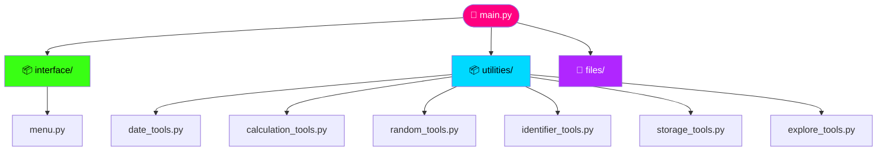

<div align="center">


<br/>


<br/><br/>


</div>

<div align="center">


</div>

---

## 📡 Table of Contents

<table>
<tr>
<td valign="top" width="25%">

**Start Here**
- [Overview](#overview)
- [Objective](#objective)
- [Prerequisites](#prerequisites)

</td>
<td valign="top" width="25%">

**Explore**
- [Features](#features)
- [File Structure](#file-structure)
- [Installation](#installation)
- [Usage](#usage)

</td>
<td valign="top" width="25%">

**See It Run**
- [Demo Video](#demo-video)
- [Sample Run](#sample-run)
- [Deliverables](#deliverables)

</td>
<td valign="top" width="25%">

**Beyond**
- [Key Learnings](#key-learnings)
- [Roadmap](#roadmap)
- [FAQ](#faq)
- [Author](#author)

</td>
</tr>
</table>

<a id="overview"></a>
## 🛸 Overview

`Moduler & Packager` is a menu-driven **Python Multi-Utility Toolkit** engineered to show off Python's modular system top to bottom — built-in modules, hand-rolled custom modules, and real packages, wired together behind one slick interface.

It runs on `datetime`, `time`, `math`, `random`, and `uuid` from the standard library, then layers a custom `utilities` package on top — file ops, calculations, identifiers, and more — every piece inspectable **live** through `dir()`.

<a id="objective"></a>
## 🎯 Objective

<table>
<tr>
<td width="25%" align="center">⚡<br><b>Built-in Power</b><br><sub><code>datetime</code> <code>time</code> <code>math</code><br><code>random</code> <code>uuid</code></sub></td>
<td width="25%" align="center">🧩<br><b>Custom Packages</b><br><sub><code>interface/</code> +<br><code>utilities/</code> w/ <code>__init__.py</code></sub></td>
<td width="25%" align="center">🛡️<br><b>Clean Scripts</b><br><sub><code>__name__ == "__main__"</code><br>on every module</sub></td>
<td width="25%" align="center">🔬<br><b>Live Exploration</b><br><sub>runtime <code>dir()</code><br>inspection</sub></td>
</tr>
</table>

<a id="prerequisites"></a>
## ✅ Prerequisites

| Requirement | Notes |
|---|---|
| 🐍 Python 3.10+ | 3.12 recommended, matches dev environment |
| 🖥️ Any OS | Windows / macOS / Linux — pure stdlib, no OS-specific calls |
| 📦 No pip installs | Everything used ships with Python itself |
| 🧰 Optional: VS Code | Project was built and tested in VS Code |

<a id="features"></a>
## ✨ Features

<details open>
<summary><b>⏰ Datetime & Time Module</b></summary>
<br>


- Display current date & time
- Diff between two dates/times
- Custom `strftime` formatting
- Stopwatch + countdown timer

</details>

<details open>
<summary><b>🧮 Math Module</b></summary>
<br>


- Trigonometry, factorials, logarithms
- Compound interest calculator
- Geometric shape area solver

</details>

<details open>
<summary><b>🎲 Random + 🆔 UUID Modules</b></summary>
<br>


- Random numbers, lists, secure passwords, OTPs
- Dataset sampling & simple game simulations
- UUID4-based unique identifiers

</details>

<details open>
<summary><b>🗂️ Custom File Ops + 🔍 Module Explorer</b></summary>
<br>


- Create / write / read / append via reusable functions
- Explore attributes of **any** module live with `dir()`

</details>

<a id="file-structure"></a>
## 🗂 File Structure



<details>
<summary>📁 raw tree</summary>

```
Python_MultiUtility/
├── main.py
├── files/
│   ├── ex.txt
│   └── sample.txt
├── interface/
│   ├── __init__.py
│   └── menu.py
└── utilities/
    ├── __init__.py
    ├── calculation_tools.py
    ├── date_tools.py
    ├── explore_tools.py
    ├── identifier_tools.py
    ├── random_tools.py
    └── storage_tools.py
```

</details>

<a id="installation"></a>
## ⚙️ Installation

```bash
git clone https://github.com/PalAnghan/Moduler-Packager-PR-7.git
cd Moduler-Packager-PR-7/Python_MultiUtility
python main.py
```

> 🟢 Zero dependencies — pure standard library.

<a id="usage"></a>
## 🚀 Usage

```
1. Datetime and Time Operations
2. Mathematical Operations
3. Random Data Generation
4. Generate Unique Identifiers (UUID)
5. File Operations (Custom Module)
6. Explore Module Attributes (dir())
7. Exit
```

<a id="demo-video"></a>
## 🎬 Demo Video

<div align="center">


*Will be embedded right here once recorded.*

</div>

<a id="sample-run"></a>
## 📟 Sample Run

```diff
+ Enter your choice: 1 → Display current date and time
+ Current Date and Time: 2025-01-04 10:15:30

+ Enter your choice: 2 → Calculate Factorial
+ Enter a number: 5
+ Factorial: 120

+ Enter module name to explore: math
+ ['acos', 'acosh', 'asin', 'asinh', 'atan', 'atanh', 'ceil', 'comb', ...]
```

<a id="deliverables"></a>
## 📦 Deliverables & Evaluation

| 📦 Deliverables | 📊 Evaluated On |
|---|---|
| Menu-driven Python source | Functionality |
| Custom modules & packages | Code structure & modularity |
| Sample outputs (logs, IDs, reports) | Documentation |
| — | Innovation |

<a id="key-learnings"></a>
## 🧠 Key Learnings

- 📦 How to turn a folder of scripts into real Python **packages** with `__init__.py`
- 🛡️ Why `__name__ == "__main__"` matters when modules are imported vs run directly
- 🔍 Using `dir()` to inspect any object or module dynamically, at runtime
- 🧩 Structuring a growing console app into an `interface` layer + `utilities` logic layer instead of one giant script

<a id="roadmap"></a>
## 🛣️ Roadmap & Future Improvements

- [ ] Add unit tests for each utility module
- [ ] Persist logs/outputs into structured JSON instead of plain `.txt`
- [ ] Package the toolkit for `pip install -e .` style local installs
- [ ] Add colorized console output for better UX

<a id="faq"></a>
## ❓ FAQ & Troubleshooting

<details>
<summary><b>ModuleNotFoundError when running main.py</b></summary>
<br>

Make sure you're running `main.py` **from inside** the `Python_MultiUtility/` folder, so Python can resolve the `interface` and `utilities` packages correctly.

</details>

<details>
<summary><b>dir() explorer shows too much noise</b></summary>
<br>

That's expected — `dir()` returns *every* attribute on a module, including dunder methods. The explorer is meant for quick discovery, not a curated API reference.

</details>

<details>
<summary><b>Can I add my own utility module?</b></summary>
<br>

Yes — drop a new `.py` file into `utilities/`, add an import in `interface/menu.py`, and wire it into the main menu the same way the existing tools are wired in.

</details>

---

<a id="author"></a>
## 👤 Author

<div align="center">


<br/>


<br/><br/>

[](mailto:palanghan8@gmail.com)
[](https://linkedin.com/in/pal-anghan)
[](https://github.com/PalAnghan)

<br/>


</div>

<br/>

<div align="center">


<sub>⭐ if this toolkit helped you — it keeps the neon lights on ⭐</sub>

</div>
