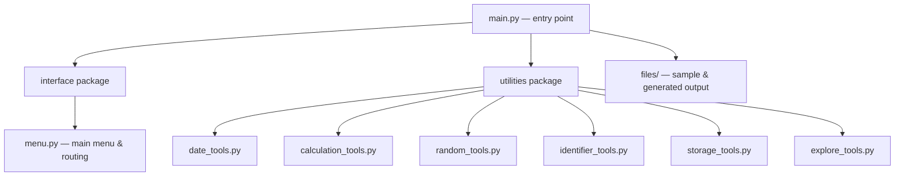

<div align="center">


```
$ python main.py
> Loading toolkit... [datetime] [math] [random] [uuid] [custom modules] ✔
> Ready. Choose an option: _
```


<br/>


<br/><br/>


</div>

<br/>

> *"Quality is our Motto." — Shaping "skills" for "scaling" higher...!!!*

---

### `$ cat table_of_contents.txt`

<table>
<tr>
<td valign="top" width="33%">

**Concept**
- [Overview](#-overview)
- [Objective](#-objective)
- [Tech Stack](#-tech-stack)

</td>
<td valign="top" width="33%">

**Build**
- [File Structure](#-file-structure)
- [Installation](#-installation)
- [Usage](#-usage)

</td>
<td valign="top" width="33%">

**Extras**
- [Demo Video](#-demo-video)
- [Sample Run](#-sample-run)
- [Author](#-author)

</td>
</tr>
</table>

---

## 🧠 Overview

`Moduler & Packager` is a menu-driven **Python Multi-Utility Toolkit** built to show off Python's modular design end to end — built-in modules, hand-rolled custom modules, and proper packages, all wired together through a clean interface layer.

It leans on `datetime`, `time`, `math`, `random`, and `uuid` from the standard library, then extends them with a custom `utilities` package (file ops, calculations, identifiers, and more) — every piece inspectable at runtime via `dir()`.

## 🎯 Objective

| Goal | How it's done |
|---|---|
| Use built-in modules practically | `datetime`, `time`, `math`, `random`, `uuid` wired into real tasks |
| Build custom modules & packages | `interface/` and `utilities/` packages, each with `__init__.py` |
| Organize scripts properly | `__name__ == "__main__"` guard on every module |
| Explore dynamically | Live `dir()` inspection of any built-in or custom module |

## 🛠 Tech Stack

<div align="center">

`Python 3.12` · `Standard Library Only` · `VS Code` · `Console UI`

</div>

## 🗂 File Structure



<details>
<summary><b>📁 Raw tree view</b></summary>

```
Python_MultiUtility/
├── main.py
├── files/
│   ├── ex.txt
│   └── sample.txt
├── interface/
│   ├── __init__.py
│   └── menu.py
└── utilities/
    ├── __init__.py
    ├── calculation_tools.py
    ├── date_tools.py
    ├── explore_tools.py
    ├── identifier_tools.py
    ├── random_tools.py
    └── storage_tools.py
```

</details>

## ⚙️ Installation

```bash
git clone https://github.com/PalAnghan/Moduler-Packager-PR-7.git
cd Moduler-Packager-PR-7/Python_MultiUtility
python main.py
```

No pip installs, no `requirements.txt` — everything runs on the standard library.

## 🚀 Usage

Launch `main.py`, then navigate the numbered menu:

```
1. Datetime and Time Operations
2. Mathematical Operations
3. Random Data Generation
4. Generate Unique Identifiers (UUID)
5. File Operations (Custom Module)
6. Explore Module Attributes (dir())
7. Exit
```

Every sub-menu loops back to the main menu, so you can chain operations without restarting.

## 🎬 Demo Video

<div align="center">

```
[ ▶ demo video not attached yet — will drop it in right here ]
```

</div>

## 📟 Sample Run

<table>
<tr><td>

```
Enter your choice: 1 → Display current date and time
Current Date and Time: 2025-01-04 10:15:30
```

</td></tr>
<tr><td>

```
Enter your choice: 2 → Calculate Factorial
Enter a number: 5
Factorial: 120
```

</td></tr>
<tr><td>

```
Enter module name to explore: math
['acos', 'acosh', 'asin', 'asinh', 'atan', 'atanh', 'ceil', 'comb', ...]
```

</td></tr>
</table>

## 📦 Deliverables & Evaluation

<table>
<tr><th>Deliverables</th><th>Evaluated on</th></tr>
<tr><td>

- Menu-driven Python source
- Custom modules & packages
- Sample outputs (logs, IDs, reports)

</td><td>

- Functionality
- Code structure & modularity
- Documentation
- Innovation

</td></tr>
</table>

---

## 👤 Author

<div align="center">
<table>
<tr>
<td align="center">

**Pal Anghan**
<br/>
Final-year BCA · AI/ML in progress

<br/>

[](mailto:palanghan8@gmail.com)
[](https://linkedin.com/in/pal-anghan)
[](https://github.com/PalAnghan)

</td>
</tr>
</table>
</div>

---

<div align="center">


`>>> Thank you for using the Multi-Utility Toolkit! 🌟`

</div>
